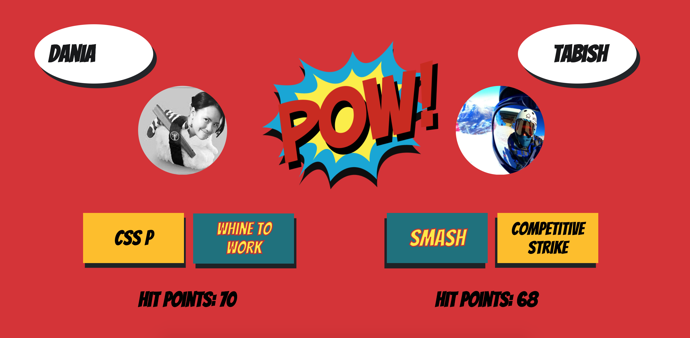

# PokeBattle (Transgressions) 🥊🎮

PokeBattle is a re-incarneted 'Tekken' battle game based on the October coding Cohort at Makers Academy. PokeBattle was done with React as the front end, Rails as the back end, and the duration of this project was for a week. The project is called "Transgressions" based on a rule at Makers Academy.

Note: This is the back-end of the project. The other half is here:   https://github.com/cristhiandas/pokebattle-react



## How To Use:

Although this is the back-end of the project, once you have this and launch this, you would need to
download the other half to see stuff on screen! However, before that, follow the instructions below:

1. Clone repo into project
```
git clone https://github.com/LewisYoul/pokebattle.git
```

2. cd into the project
```
cd/pokebattle
```

3. Install all the gems and dependencies
```
bundle install
```

4. Setup the databases locally
```
bin/rails rake db:setup
```
5. Download CORS on google Chrome as a google Chrome extension. Make sure it's green
```
https://chrome.google.com/webstore/detail/cors-toggle/jioikioepegflmdnbocfhgmpmopmjkim?hl=en
```

5. Run the sever on port 4000
```
bin/rails s -p 4000
```

~Go download the front-end and enjoy!

## Approach:

Inspired by a Tekken Game and our cohort members at Makers Academy, we initially drew out an MVP to setup the basics of what made our game unique. From there, whilst working in pairs, we expanded into the other User stories we achieved (that is listed down below).

### Technologies

Front-End: React
 (Gems)
 - React-Sound
 - React-Toggle-Display

Back-End: Ruby On Rails
 - Responders


### Challenges

| Successes             | Failures                    |
| --------------------- |:---------------------------:|
| Accomplished MVP      | Testing (Figuring out Jest) |
| Delegated teamwork    |                             |
| Had a  good time      | -                           |


## MVP:

It was vital for us to create an MVP as we had to pinpoint what made our game unique. This was
our starting point/goal for building the project.

```
As a user,
So I can be engaged with the battle game,
I would like to see two characters on the screen
```

```
As a user,
So I can be start playing the battle game,
I would like to attack a player (and see a reaction)
```

```
As a user,
So I can be start playing the battle game,
I would like the attacked player to receive damage to their health bar  
```

## Other User Stories (That were accomplished):

Throughout the week, we branched off into accomplishing the following user stories. Although we
brainstormed many, these are the ones that were achieved during the week.

```
As a user,
So I can be start playing the battle game,
I would like to be able to select a player
```

```
As a user,
So I can play against another player
I would like to play against another player
```

```
As a user,
So I can choose my player wisely
I would like to see the details of the other player
```

```
As a user,
So I can play the game happily,
I would like to play the game that has a sexy interface
```

```
As a user,
So I can get in the mood to play a game,
I would like to have background music whilst playing the game.
```

```
As a user,
So I can choose to attack a player,
I would like to have more than one attack on the battle page.
```

```
As a user,
So I can see the damage the other player has costs me,
I would like to see the changed hp on the screen.
```

```
As a user,
So I can see I've attacked a player,
I would like to see some effect when I attack a player.
```

```
As a user,
So I can know when I lose a game,
I would like to see a GameOver Page.
```

```
As a user,
So I can play the game again,
I would like to be redirected to the character page again!
```

## Team Members:  

- 🐿 Cristhian Da Silva (https://github.com/cristhiandas)
- 🐱 Dania Mah (https://github.com/thatdania)
- 🐸 Lewis Youl (https://github.com/LewisYoul)
- 🐈 Marco Vanali (https://github.com/Vanals)
- 🐻 Oleg Grushetskyy (https://github.com/olegfkl)
- 🦅 Tabish Raza (https://github.com/tabrza)
